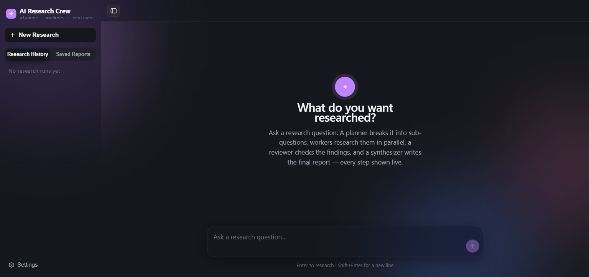
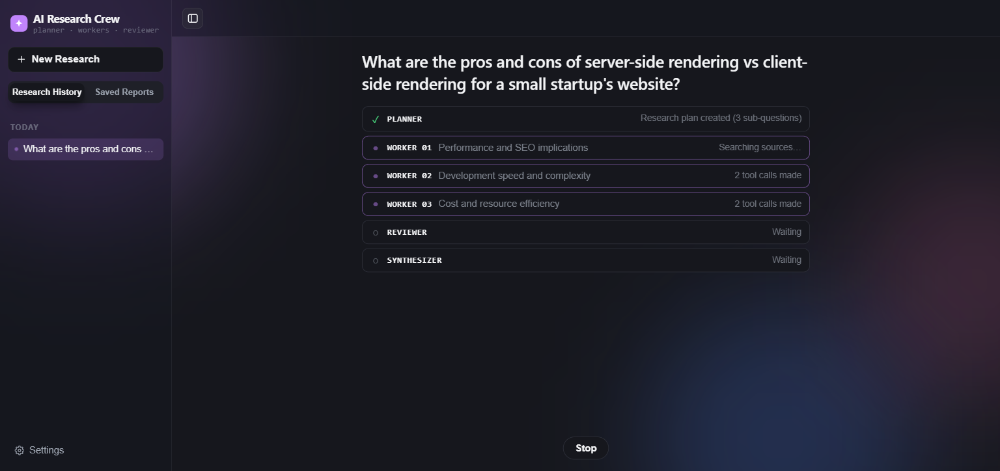
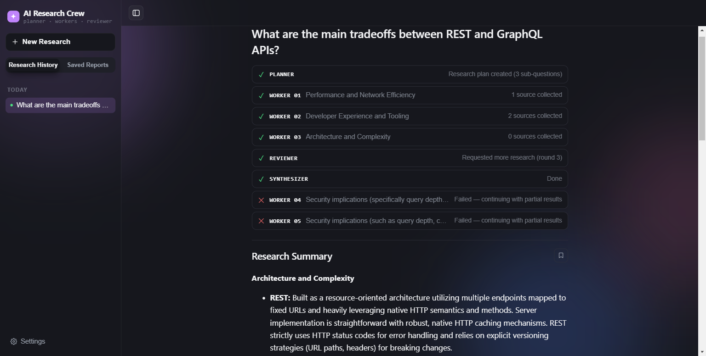

# AI Research Crew

**Live demo:** https://delightful-desert-0af6ccc00.7.azurestaticapps.net

Ask it a research question. A **Planner** breaks it into sub-questions, a set of
**Worker** agents research them *concurrently* (real web search + page fetches,
not scripted), a **Reviewer** checks the findings for gaps and contradictions
and can send workers back for another round, and a **Synthesizer** writes the
final, cited answer. Every step streams to the UI live as it happens — this is
genuine multi-agent orchestration with planning, tool use, and reflection, not
a single "call the LLM once" wrapper.

> This project started as a single-agent tool-calling chatbot (see git
> history) and was rebuilt into this multi-agent pipeline. The live
> deployment described under [Deployment](#deployment) now serves this
> multi-agent version.

Three things separate this from a basic multi-agent demo:

1. **Real concurrent workers, real fan-in.** Workers don't just run in
   parallel — their live progress (`tool_call`/`tool_result`/`worker_done`)
   is merged into one ordered event stream via an `asyncio.Queue`, so the UI
   shows worker 2 finishing before worker 1 the moment it actually happens,
   not after everything completes.
2. **Structured output everywhere, not regex-parsed free text.** The
   Planner's plan, each Worker's finding, the Reviewer's verdict, and the
   Synthesizer's answer are all Pydantic models passed to Gemini as
   `response_schema` — the JSON shape in the examples below is literally what
   the model returns, validated on the way in.
3. **A bounded reflection loop.** The Reviewer can send workers back for
   another research round on specific gaps it names — capped at
   `MAX_REVIEW_ITERATIONS = 2` extra rounds so a stubborn reviewer can't loop
   the pipeline forever.

## Architecture

```
POST /research/run  (question)
  │
  ▼
PLANNER            — structured plan: 2-5 independent sub-questions
  │
  ▼
WORKERS (parallel)  — each: tool-calling loop (web_search, fetch_url) → structured finding
  │
  ▼
EVIDENCE POOL       — findings merged as they complete
  │
  ▼
REVIEWER            — structured review: approved? gaps? contradictions? unsupported claims?
  │
  ├── needs more research (bounded) ──► WORKERS on the flagged gaps only ──┐
  │                                                                        │
  │◄───────────────────────────────────────────────────────────────────────┘
  ▼ approved (or cap reached)
SYNTHESIZER         — final markdown answer + key findings + citations
  │
  ▼
trace_summary       — every agent's duration, sources found, review round count
```

- **`backend/llm.py`** — the one shared Gemini client every agent uses.
  Two entry points: `generate_structured(prompt, schema)` (a single call
  constrained to a Pydantic `response_schema`, used by Planner/Reviewer/
  Synthesizer and a Worker's write-up step) and `generate_with_tools(...)`
  (the tool-calling loop, used by Workers to gather evidence). Both share one
  retry helper (429 → exponential backoff, up to `MAX_RETRIES = 6`) and one
  `asyncio.Semaphore(2)` capping how many Gemini calls are in flight at once
  — a multi-agent run fires enough calls in quick succession that an
  unthrottled burst can blow through a free-tier requests-per-minute limit
  even though the total call volume is modest (see
  [Known limitations](#known-limitations)).
- **`backend/research/schemas.py`** — the typed contracts:
  `ResearchPlan`/`SubQuestion`, `WorkerFinding`, `ReviewResult`,
  `FinalAnswer`. Used for prompting (as `response_schema`), validation, the
  API response, and storage — one definition, no duplication.
- **`backend/research/tools.py`** — `web_search` (DuckDuckGo, reused
  unchanged from the project's original tools) plus `fetch_url` (requests +
  BeautifulSoup), so a worker can read a full source after finding it, not
  just a search snippet.
- **`backend/research/planner.py` / `worker.py` / `reviewer.py` /
  `synthesizer.py`** — one file per agent, each a thin function around
  `llm.py`. A Worker never raises: `run_worker` catches its own failures and
  returns a `WorkerFinding(failed=True, ...)` instead, so one bad worker
  never takes the run down (see `tests/test_worker.py`).
- **`backend/research/orchestrator.py`** — `run_research()`, the async
  generator described above. Fans concurrent workers into one stream, tracks
  per-agent timing for `trace_summary`, enforces the review-iteration cap,
  and wraps every phase so a Planner/Reviewer/Synthesizer failure ends the
  run with a clear `error` event instead of a crash.
- **`backend/main.py`** — `POST /research/run` streams the pipeline as
  newline-delimited JSON (same transport shape the project's original
  single-agent `/chat` used). `GET /research`, `GET /research/{id}`,
  `PATCH /research/{id}` (toggle saved), `DELETE /research/{id}` mirror the
  project's original conversation-history endpoints, for signed-in users.
- **`backend/db.py`** — SQLite: `users`/`sessions` (Google sign-in, unchanged
  from the original project) plus `research_runs`/`research_events` (one row
  per run, one row per agent step — the "Research Process" timeline in the
  UI reads straight from `research_events`).
- **`frontend/`** — React (Vite). Sidebar: New Research / Research History /
  Saved Reports / Settings. Submitting a question renders a live
  `PipelineTimeline` (one row per agent, ○/●/✓/✕ status, driven directly by
  the event stream) that settles into a `ResearchReport` (answer, key
  findings, source cards, a Quality Review checklist derived from the
  Reviewer's verdict, and an expandable Research Process timeline).
  Anonymous use keeps run history in `localStorage`; signing in with Google
  upgrades it to server-persisted, cross-device history — identical pattern
  to the project's original chat history, just for research runs.

## Running it

**Backend:**
```
cd backend
pip install -r requirements.txt
cp .env.example .env   # add your GEMINI_API_KEY (free at aistudio.google.com/apikey)
uvicorn main:app --reload --port 8001
```

**Frontend:**
```
cd frontend
npm install
npm run dev
```

`app.db` is created automatically on first run (SQLite, gitignored — runtime
state, not source).

## Environment variables

| Variable | Required | Notes |
|---|---|---|
| `GEMINI_API_KEY` | yes | Free at aistudio.google.com/apikey. Every agent shares one client (`llm.py`). |
| `GEMINI_MODEL` | no | Defaults to `gemini-3.5-flash-lite`. |
| `GOOGLE_CLIENT_ID` | no | Only needed for sign-in / server-persisted history; the pipeline works fully anonymously without it. |
| `VITE_API_URL` (frontend) | no | Defaults to `http://localhost:8001`. |
| `VITE_GOOGLE_CLIENT_ID` (frontend) | no | Same Google client ID, frontend side. |

No new secrets versus the project's original version — this stays a
zero-signup-friction demo (`web_search` needs no API key, `fetch_url` is
plain HTTP).

## Testing

```
cd backend
pytest
```

28 tests, LLM fully mocked (no real API calls, no cost, deterministic):
`tests/test_schemas.py` (structured-output validation edge cases),
`tests/test_llm.py` (429 retry/backoff behavior), `tests/test_worker.py` (a
worker never raises — gather-phase and write-up-phase failures both degrade
to a `failed` finding), `tests/test_orchestrator.py` (happy path; reviewer
requests another round then approves; `MAX_REVIEW_ITERATIONS` cap still
synthesizes; a partial worker failure doesn't crash the run; a planner
failure ends the run cleanly), `tests/test_api.py` (the full `/research/run`
event stream shape, history CRUD, auth gating, and — as the end-to-end case —
that a signed-in run's DB row exists with the right status/answer after the
stream completes). CI (`.github/workflows/ci.yml`) runs the same suite on
every push.

## How to add another agent

Agents are just a function returning (or yielding events toward) a typed
result — there's no framework object to subclass. To add one (say, a
"Fact-Checker" that runs after the Synthesizer):

1. Add its output shape to `research/schemas.py` (a Pydantic model).
2. Write `research/fact_checker.py`: one function, `check(answer) ->
   FactCheckResult`, calling `llm.generate_structured(...)` (or
   `generate_with_tools` if it needs to search).
3. Call it from `orchestrator.py` after `synthesizer.synthesize(...)`, timed
   and wrapped in try/except like every other phase, appending to `trace` and
   yielding `fact_check_start`/`fact_check_done` events.
4. Add a case for those event types to `reducePipelineEvent` in
   `frontend/src/App.jsx` (label, status, detail text) — the row appears in
   the pipeline automatically.

## How to add another research tool

`fetch_url` (in `research/tools.py`) is the worked example: a plain Python
function with a narrow, typed contract (`url: str -> str`), added to both
`TOOL_FUNCTIONS` (the dispatch dict Workers execute against) and
`TOOL_DECLARATIONS` (the schema Gemini sees). To add another one — say a
`search_academic_papers` tool — write the function, add it to both, and every
Worker gets it automatically; no other code changes.

## Example query

```
curl -X POST http://localhost:8001/research/run \
  -H "Content-Type: application/json" \
  -d '{"question": "What are the main tradeoffs between pgvector and Pinecone for a small RAG app?", "run_id": "demo-1"}'
```

Streams newline-delimited JSON — trimmed to one event per phase (a real run
interleaves several `tool_call`/`tool_result` events per worker):

```
{"type": "plan_start"}
{"type": "plan_done", "sub_questions": [{"id": "sq1", "topic": "Architecture and Infrastructure", ...}, ...], "duration_ms": 2042}
{"type": "worker_start", "worker": "worker_01", "topic": "Architecture and Infrastructure"}
{"type": "tool_call", "worker": "worker_01", "tool": "web_search", "args": {"query": "pgvector vs pinecone architecture"}}
{"type": "tool_result", "worker": "worker_01", "tool": "web_search", "result": "...", "latency_ms": 1840}
{"type": "worker_done", "worker": "worker_01", "finding": {"task": "...", "findings": [...], "sources": [...], "confidence": "medium", "limitations": [], "failed": false}, "duration_ms": 23351}
{"type": "review_start", "iteration": 1}
{"type": "review_done", "iteration": 1, "review": {"approved": true, "missing_topics": [], "contradictions": [], "unsupported_claims": [], "additional_research_required": false, "feedback": [...]}, "duration_ms": 1525}
{"type": "synthesis_start"}
{"type": "synthesis_done", "answer": {"answer_markdown": "...", "key_findings": [...], "citations": [...]}, "duration_ms": 3883}
{"type": "trace_summary", "agents": [...], "total_ms": 45210, "review_iterations": 1}
```

Real captured run, unedited (this one hit free-tier rate limits partway
through — kept as the example on purpose, see
[Known limitations](#known-limitations)):

```
Research #smoke-test-3
planner            2.0s
worker_01          76.1s  (0 sources — rate-limited, failed)
worker_02          87.2s  (0 sources — rate-limited, failed)
worker_03          91.2s  (0 sources — rate-limited, failed)
worker_04          77.7s  (0 sources — rate-limited, failed)
reviewer_round_1    1.5s
worker_05..08       — round 2, reviewer flagged the gaps
reviewer_round_2    1.5s
worker_09..12       — round 3
synthesizer         3.9s
Total             247.7s   review_iterations: 3
```

That run's final answer, verbatim: *"Based on the provided research
findings, direct information regarding the specific trade-offs between
pgvector and Pinecone is unavailable due to task failures, rate limits, and
uncompleted research steps... a direct comparison ... cannot be established
from the findings."* — this is the Synthesizer's "avoid hallucinated
references" instruction doing exactly its job under real, unplanned failure:
it had almost no usable findings and said so, rather than inventing a
comparison it had no evidence for.

## Screenshots

Empty state:



A run in progress — three workers researching concurrently, live tool-call
counts, reviewer/synthesizer waiting their turn:



A completed run — the reviewer requested a second round of research, two
follow-up workers failed but the synthesizer still produced a full report
from partial results, with citations and a step/timing summary:



## Deployment

Live at:
- **Frontend** — https://delightful-desert-0af6ccc00.7.azurestaticapps.net
- **Backend** — https://ai-research-agent-backend.azurewebsites.net

- **Frontend** — Azure Static Web Apps (Free tier), built with Vite
  (`VITE_API_URL` pointed at the backend) and pushed with the Static Web
  Apps CLI (`swa deploy ./frontend/dist --deployment-token <token> --env
  production`, run from the repo root — the CLI refuses to run from inside
  the app-location folder).
- **Backend** — Azure App Service (Linux, B1, Python 3.12) via `az webapp
  deploy --type zip` (a zip built with Python's `zipfile`, not PowerShell's
  `Compress-Archive`, which writes backslash path separators that break
  subdirectory imports on Linux — see `research/` needing to survive the
  zip). Startup command: `uvicorn main:app --host 0.0.0.0 --port 8000`.
- **Why App Service instead of Container Apps** (which `Dockerfile`/CI still
  target) — this subscription is an Azure for Students grant, and Azure
  Container Registry's remote build is disabled on that tier.
- **SQLite persistence** — `app.db` lives at `AI_AGENT_DB_DIR` (set to
  `/home/data` in production, App Service's persistent mount) so it survives
  restarts/redeploys. The schema changed in this rebuild (`research_runs`/
  `research_events` replace the old `conversations`/`messages`), so a
  redeploy of this version needs a fresh `app.db` — it's gitignored runtime
  state, not something to migrate by hand.

## Known limitations

- **Free-tier rate limits under real concurrent load.** A run fires enough
  Gemini calls in quick succession (several workers × several calls each,
  plus reviewer/synthesizer) that it can exceed the free tier's
  requests-per-minute limit even with the throttling in `llm.py` (a
  semaphore capping concurrent calls, staggered worker starts, 6-attempt
  backoff). The system degrades correctly when this happens — failed workers
  are marked `failed` and the run continues with partial findings, a failed
  Reviewer falls back to an unreviewed pass-through, a failed Synthesizer
  ends the run with a clear error — but a heavily rate-limited run can take
  several minutes and produce a thin answer. This is a real, observed
  behavior (see the example above), not a hypothetical; the honest fix is a
  paid tier or a lower-traffic testing cadence, not more client-side code.
- **No token-level streaming of the final answer.** The Synthesizer's
  markdown arrives as one `synthesis_done` event once the call completes,
  not word-by-word — a deliberate scope call, since Gemini's structured
  (`response_schema`) mode doesn't stream partial JSON in a form worth
  rendering incrementally. What *does* stream live is the pipeline itself
  (each agent's start/progress/done).
- **No persistence mid-run.** A signed-in user's run is written to
  `research_runs` once, after the stream finishes (success or error) —
  closing the tab mid-run loses that run's history entry (anonymous
  `localStorage` history has the same property, since it's built from the
  same stream).

## Interview prep

**Why hand-rolled orchestration instead of CrewAI/LangGraph?** Control and
observability. The point of this project is the live pipeline view and a
typed event stream the frontend can render — that means owning exactly when
each event fires, which a framework's own event/callback surface would sit
between. The actual orchestration logic (a bounded review loop, a queue-based
fan-in for concurrent workers) is a few dozen lines of `asyncio`, not enough
complexity to justify a framework dependency for this scope.

**Why structured output (`response_schema`) instead of asking the model for
JSON and parsing it?** Reliability and less code. `response_schema` makes
Gemini constrain its own output to the shape, and `response.parsed` returns
an already-validated Pydantic instance — no regex, no "strip the markdown
code fence the model added anyway," no silent acceptance of a malformed
shape. It's also literally the same shape used for prompting, validating, the
API response, and storage — one model, not four ad-hoc conversions.

**What stops the reviewer from looping forever?** `MAX_REVIEW_ITERATIONS =
2` extra rounds in `orchestrator.py` — after that, the pipeline synthesizes a
best-effort answer from whatever it has, rather than researching forever.
Independently, each *worker* also has its own step cap (`max_steps=3` in its
tool-calling loop), so a single stuck worker can't hang a round either.

**How does a bad worker not take the whole run down?** `run_worker` in
`worker.py` never raises — both its gather phase (tool use) and write-up
phase (structured output) are wrapped in try/except, returning a
`WorkerFinding(failed=True, limitations=[...])` on any failure. The
orchestrator's queue-based fan-in depends on this contract: it waits for a
`worker_done` event per worker, so a worker that raised instead of returning
would stall the batch forever (see `tests/test_worker.py` for why this
contract is tested directly, not just exercised incidentally through
orchestrator tests).

**Why was the old single-agent `/chat` (and its cross-session semantic
memory in `memory.py`) removed instead of kept as a second mode?** Scope and
coherence. This project's story is "multi-agent research system," and the
old chat's premise — a multi-turn conversation with implicit chat history —
doesn't compose with a single-shot "ask a question, get a report" pipeline
without meaningfully more UI/state complexity (two different history models,
two different composers). The chat's cross-session memory (embed a question,
recall similar past exchanges) is also a chat-specific idea; a research run's
"history" is just a list of past reports, not something semantic recall adds
to. The old implementation is still in git history if either idea is worth
resurrecting later.

**What happens when a research run genuinely can't be answered well (see the
example run above)?** The Synthesizer is instructed to "never invent a
source that isn't in the findings" and to note real uncertainty rather than
paper over gaps — verified live under actual rate-limit-induced failures
(not a staged test): with almost no usable findings, it said so directly
instead of fabricating a confident comparison. That instruction is doing
real work, not just decorating the prompt.
