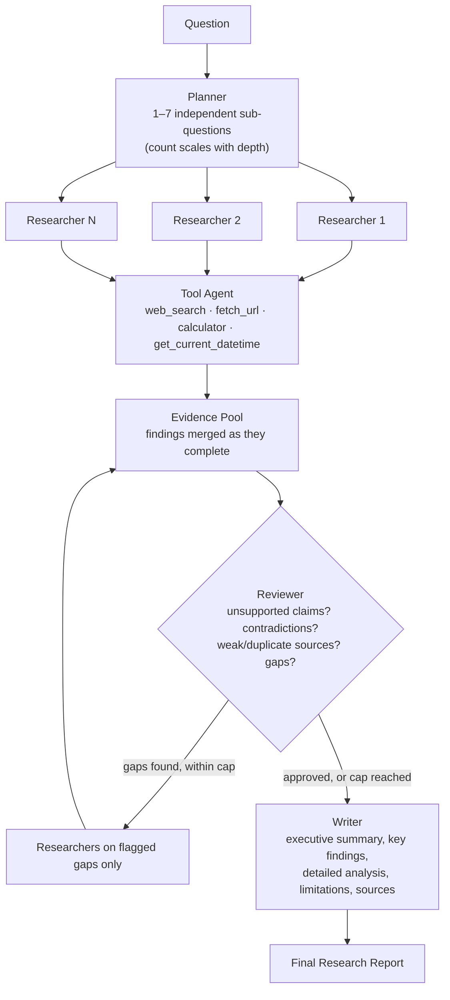

# ResearchOS

**Live demo:** https://delightful-desert-0af6ccc00.7.azurestaticapps.net

A multi-agent AI research workspace: ask a question, watch a **Planner**,
**Researchers**, a **Tool Agent**, a **Reviewer**, and a **Writer** turn it into a
cited report — live, with projects, saved sources, research history, and an
agents status page around it. This is a rebuild of an earlier single-agent
tool-calling chatbot (see git history) into a full research SaaS: same
underlying Gemini pipeline and tools, now with real per-user data (projects,
sessions, sources, reports), full auth, and a "Liquid Glass" UI.

> Every "execution" detail the UI shows — agent name, task, status, tool
> used, search query, result summary, timestamp, errors — is real, pulled
> from actual pipeline events or database rows. The app never exposes the
> model's raw chain-of-thought, and it never fabricates data (source dates
> it doesn't have, relevance scores it didn't compute, agent stats it didn't
> log) — see [Known limitations](#known-limitations) for what that costs.

## Architecture



Every box above is a real pipeline stage, not illustrative — the Planner and
Writer are `response_schema`-constrained Gemini calls, Researchers run
concurrently via `asyncio.gather`, and the Reviewer's "gaps found" branch is
a genuine bounded loop (`MAX_REVIEW_ITERATIONS`, depth-dependent), not a
diagram simplification of a single pass.

- **`backend/llm.py`** — the one shared Gemini client every agent uses:
  `generate_structured` (a single call constrained to a Pydantic
  `response_schema` — Planner/Reviewer/Writer and a Researcher's write-up
  step) and `generate_with_tools` (the tool-calling loop a Researcher uses
  to gather evidence). Both share a 429-backoff retry helper and a
  semaphore capping concurrent Gemini calls (a multi-agent run fires enough
  calls in quick succession to blow through a free-tier rate limit
  otherwise — see [Known limitations](#known-limitations)).
- **`backend/research/schemas.py`** — the typed contracts (`ResearchPlan`,
  `SourceItem`, `WorkerFinding`, `ReviewResult`, `FinalAnswer`), used for
  prompting (as `response_schema`), validation, the API response, and
  storage. `SourceItem` (`{title, url}`) is why sources are never
  fabricated: it's exactly what the model saw in a `web_search`/`fetch_url`
  result, not a bare URL the frontend has to guess a title for.
- **`backend/research/tools.py`** — `web_search` (DuckDuckGo), `fetch_url`
  (requests + BeautifulSoup, reads a full source instead of a snippet),
  `calculator` (safe AST-based arithmetic — no `eval()`), and
  `get_current_datetime`.
- **`backend/research/planner.py` / `researcher.py` / `reviewer.py` /
  `writer.py`** — one file per agent. A Researcher never raises:
  `run_researcher` catches its own failures and returns a
  `WorkerFinding(failed=True, ...)` instead, so one bad researcher never
  takes the run down (see `tests/test_researcher.py`).
- **`backend/research/orchestrator.py`** — `run_research()`, an async
  generator that fans concurrent researchers into one ordered event stream,
  enforces the review-iteration cap, applies per-run agent toggles and
  depth settings, and wraps every phase so a failure ends the run with a
  clear `error` event instead of a crash.
- **`backend/main.py`** — the FastAPI app: the streaming research endpoint,
  plus ordinary per-user CRUD for projects, sources, history, dashboard
  metrics, and agent status. See [API](#api) below.
- **`backend/db.py`** — SQLite, stdlib `sqlite3` only. Migrations are
  additive (`ALTER TABLE ... ADD COLUMN`, guarded by a column-existence
  check) so redeploying never drops existing rows. See
  [Database](#database).
- **`frontend/`** — React (Vite) + `react-router-dom`. A "Liquid Glass"
  component library (`components/glass/`) — translucent blurred surfaces,
  indigo/electric-blue/violet accents, no neon — backs every page:
  Dashboard, New Research, Live Research, a Project workspace, Sources,
  History, Agents, Settings, and full auth screens.

## Agent workflow

1. **Planner** (`research/planner.py`) turns the question into 1-7
   sub-questions (the range scales with the chosen research depth — see
   below), each independently researchable.
2. **Researchers** (`research/researcher.py`) run concurrently, one per
   sub-question. Each is a two-phase Gemini loop: gather evidence with
   tools (free-form), then write up a structured `WorkerFinding` (schema-
   constrained) — separated because Gemini doesn't reliably do free tool
   use and constrained JSON output in the same call.
3. **Tool Agent** — not a separate Gemini call: the orchestrator already
   emits `tool_call`/`tool_result` events per researcher, and the frontend
   folds them into one aggregated "Tool Agent" row so the pipeline visually
   matches the diagram above, without restructuring how tools are actually
   invoked.
4. **Reviewer** (`research/reviewer.py`) checks the pooled findings for
   unsupported claims, contradictions, weak/duplicate sources, and gaps.
   If it flags real gaps, up to `MAX_REVIEW_ITERATIONS` (depth-dependent)
   extra research rounds run against just those gaps.
5. **Writer** (`research/writer.py`) synthesizes the reviewed findings into
   the final report — organized, cited, honest about what it couldn't
   establish.

**Research depth** (`quick` / `standard` / `deep`) is a real pipeline
parameter, not a label: it changes the Planner's requested sub-question
range, each Researcher's tool-call step budget, and how many extra review
rounds the Reviewer is allowed (0 / 2 / 3) — see `DEPTH_SETTINGS` in
`orchestrator.py`.

**Agent configuration** — Reviewer and Writer can be toggled off per run
(Planner and Researcher can't: there's no pipeline without them, and the API
rejects a request that tries). Reviewer off skips the reflection loop
entirely; Writer off compiles the raw findings directly instead of asking
Gemini to synthesize them — a genuinely different, rawer report, not a
fake shortcut.

## Tools

| Tool | What it does |
|---|---|
| `web_search` | DuckDuckGo search, returns titles/snippets/URLs |
| `fetch_url` | Reads a specific URL's full text (not just a snippet) |
| `calculator` | Safe AST-based arithmetic (no `eval()`) — for cost/growth comparisons |
| `get_current_datetime` | Current UTC date/time |

## Database

SQLite (`backend/db.py`), one file, stdlib only:

- `users` — Google accounts and/or email+password accounts (a user can have
  either, `password_hash` is nullable).
- `sessions` — opaque bearer tokens, one row per signed-in device (`user_agent`
  captured at login, shown on the Security page).
- `password_resets` — single-use, time-limited reset tokens.
- `projects` — per-user, `active`/`archived`.
- `research_runs` — one row per research session: question, status
  (`running`/`done`/`error`, written *at start*, not just completion — see
  [Known limitations](#known-limitations)), depth, agent config, the final
  report, and an optional `project_id`.
- `research_events` — one row per pipeline step (agent name, duration, and
  — for researchers — the full structured finding), read back to rebuild a
  past run's timeline and to power **Regenerate report**.
- `sources` — extracted from every researcher's structured findings when a
  run is saved: title, URL, domain (parsed from the URL), relevance (derived
  from that researcher's own confidence judgment), and `saved`/`removed`
  flags for the Sources page. No `published_at` is synthesized — it's
  `NULL` unless a source actually carried one, which none of this app's
  tools currently surface.

## API

All endpoints except `/health` and `/auth/*` require `Authorization: Bearer
<session_token>` and are scoped strictly to the requesting user (a lookup
for another user's project/run/source 404s, never 403 — so a request can't
even confirm the resource exists).

| Area | Endpoints |
|---|---|
| Auth | `POST /auth/google`, `POST /auth/signup`, `POST /auth/login`, `POST /auth/forgot-password`, `POST /auth/reset-password`, `POST /auth/logout`, `GET /me`, `PATCH /me`, `POST /me/password`, `GET/DELETE /me/sessions/{token}` |
| Projects | `GET/POST /projects`, `GET/PATCH/DELETE /projects/{id}`, `GET /projects/{id}/runs` |
| Research | `POST /research/run` (streams NDJSON), `GET /research` (filters: `status`, `project_id`, `saved`, `q`), `GET/PATCH/DELETE /research/{id}`, `POST /research/{id}/restart`, `POST /research/{id}/regenerate-report` |
| Sources | `GET /sources` (filters: `run_id`, `project_id`, `relevance`, `saved`), `PATCH /sources/{id}` |
| Dashboard / Agents | `GET /dashboard`, `GET /agents` |

`POST /research/run` streams newline-delimited JSON — one line per pipeline
event (`plan_start`/`plan_done`, `researcher_start`/`tool_call`/
`tool_result`/`researcher_done`, `review_start`/`iteration_start`/
`review_done`, `writing_start`/`writing_done`, `trace_summary`, `error`).
These are exactly the "safe execution information" the UI is allowed to
show — agent, task, status, tool, query, result summary, timestamp,
errors — never the model's internal reasoning, which the backend doesn't
even ask Gemini to return in a form worth exposing.

## Authentication

Two ways in, one session model: Google Sign-In (verifies Google's ID token,
upserts a user) and email/password (bcrypt-hashed, `backend/auth.py`) both
end at the same opaque bearer token in the `sessions` table — the frontend
never holds a Google JWT or a password hash. Password reset uses a
single-use, 1-hour-expiry token emailed via Resend's HTTP API
(`backend/email_service.py`); `POST /auth/forgot-password` does the same
amount of work whether or not the account exists (email lookup happens
*after* the config check, so a missing `RESEND_API_KEY` 500s identically
either way) — it never leaks account existence.

## Security

- Passwords: bcrypt, never logged or returned by any endpoint.
- Sessions: opaque random tokens, revocable individually from the Security
  page; a user can only revoke their own.
- Ownership checks on every project/run/source lookup (see [API](#api)).
- Tool inputs are validated by the schema Gemini is given (`research/tools.py`'s
  `TOOL_DECLARATIONS`) and `calculator` uses AST evaluation, never `eval()`.
- Rate limiting: a semaphore in `llm.py` caps concurrent Gemini calls
  (protects the shared API key from a burst); there's no per-user HTTP rate
  limit yet — see [Known limitations](#known-limitations).
- Secrets (`GEMINI_API_KEY`, `GOOGLE_CLIENT_ID`, `RESEND_API_KEY`) are
  server-side only, read from environment variables, never sent to the
  frontend.

## Testing

```
cd backend
pytest
```

73 tests, every external call mocked (Gemini via monkeypatching, Resend via
monkeypatching `email_service.send_password_reset_email`, DDGS/`requests`
never hit) — deterministic, no cost, no live API dependency:

- `test_schemas.py` — structured-output validation, including that
  `WorkerFinding.sources` rejects a bare URL (must be a `SourceItem`).
- `test_planner.py` — depth changes the requested sub-question range.
- `test_researcher.py` — a researcher never raises; gather-phase and
  write-up-phase failures both degrade to a `failed` finding.
- `test_orchestrator.py` — happy path; the reviewer's bounded re-research
  loop; the max-iteration cap; a partial researcher failure not crashing
  the run; the reviewer/writer agent toggles.
- `test_llm.py` — 429 retry/backoff behavior.
- `test_auth_password.py` — signup/login/forgot/reset, duplicate-email and
  wrong-password rejection, a Google-only account correctly failing
  password login, change-password, session list/revoke, and that
  forgot-password never reveals whether an account exists.
- `test_projects.py` / `test_sources.py` — CRUD, archive, save/remove, and
  cross-user permission checks (404, not 403).
- `test_api.py` — the full `/research/run` event stream shape, history
  filters, restart, regenerate-report, the "running" row written at stream
  start (not just completion), and cross-user permission checks.

CI (`.github/workflows/ci.yml`) runs the same suite on every push.

## Deployment

Live at:
- **Frontend** — https://delightful-desert-0af6ccc00.7.azurestaticapps.net
- **Backend** — https://ai-research-agent-backend.azurewebsites.net

- **Frontend** — Azure Static Web Apps (Free tier), built with Vite
  (`VITE_API_URL` pointed at the backend) and pushed with the Static Web
  Apps CLI (`swa deploy ./frontend/dist --deployment-token <token> --env
  production`, run from the repo root).
- **Backend** — Azure App Service (Linux, B1, Python 3.12) via `az webapp
  deploy --type zip` (a zip built with Python's `zipfile`, not PowerShell's
  `Compress-Archive`, which writes backslash path separators that break
  subdirectory imports on Linux).
- **SQLite persistence** — `app.db` lives at `AI_AGENT_DB_DIR`
  (`/home/data` in production, App Service's persistent mount).
  `init_db()`'s migrations are additive (see [Database](#database)), so
  redeploying this rebuild onto the existing database upgrades it in place
  — it does not need a fresh `app.db`.
- **Required environment variables in production**: `GEMINI_API_KEY`,
  `GOOGLE_CLIENT_ID` (optional), `RESEND_API_KEY` + `FROM_EMAIL` (needed
  only for password-reset emails to actually send — every other feature
  works without them), `AI_AGENT_DB_DIR=/home/data`.

## Running it locally

**Backend:**
```
cd backend
pip install -r requirements.txt
cp .env.example .env   # add your GEMINI_API_KEY (free at aistudio.google.com/apikey)
uvicorn main:app --reload --port 8001
```

**Frontend:**
```
cd frontend
npm install
npm run dev
```

`app.db` is created (and migrated) automatically on first run — gitignored
runtime state, not source.

## Example research workflow

A real, captured run (`depth: "quick"`, so one Planner pass, one research
round, no review iterations beyond the first):

```
curl -X POST http://localhost:8001/research/run \
  -H "Content-Type: application/json" -H "Authorization: Bearer <token>" \
  -d '{"question": "What is the capital of France and what is 12*7?", "run_id": "smoke-run-1", "depth": "quick"}'
```

Trimmed to one event per phase (a real run interleaves several
`tool_call`/`tool_result` events per researcher):

```
{"type": "plan_start"}
{"type": "plan_done", "sub_questions": [{"id": "sq1", "topic": "Capital of France", ...}, {"id": "sq2", "topic": "Mathematical calculation", ...}]}
{"type": "researcher_start", "researcher": "researcher_01", "topic": "Capital of France"}
{"type": "tool_call", "researcher": "researcher_01", "tool": "web_search", "args": {"query": "capital of France"}}
{"type": "researcher_done", "researcher": "researcher_01", "finding": {"sources": [{"title": "Wikipedia, \"Capital of France\"", "url": "https://en.wikipedia.org/wiki/Capital_of_France"}], "confidence": "high", ...}}
{"type": "researcher_start", "researcher": "researcher_02", "topic": "Mathematical calculation"}
{"type": "tool_call", "researcher": "researcher_02", "tool": "calculator", "args": {"expression": "12*7"}}
{"type": "researcher_done", "researcher": "researcher_02", "finding": {"findings": ["The product of 12 and 7 is 84."], "sources": [], "confidence": "high", ...}}
{"type": "review_start", "iteration": 1}
{"type": "review_done", "iteration": 1, "review": {"approved": true, "feedback": ["All planned sub-questions were successfully addressed.", "Claims are well-supported by sources or represent fundamental mathematical truths."]}}
{"type": "writing_start"}
{"type": "writing_done", "answer": {"answer_markdown": "# Research Report\n\n## Capital of France\nThe official capital of France is Paris (https://en.wikipedia.org/wiki/Capital_of_France, https://en.wikipedia.org/wiki/Paris).\n\n## Mathematical Calculation\nThe product of 12 multiplied by 7 is 84.", "key_findings": ["The official capital of France is Paris.", "The product of 12 and 7 is 84."], "citations": ["https://en.wikipedia.org/wiki/Capital_of_France", "https://en.wikipedia.org/wiki/Paris"]}}
{"type": "trace_summary", "agents": [...], "total_ms": 11349, "review_iterations": 1}
```

Once the run finishes, `GET /sources` shows exactly what the Researcher
saw — real titles and domains, no invented dates:

```
[{"title": "Wikipedia, \"Capital of France\"", "url": "https://en.wikipedia.org/wiki/Capital_of_France", "domain": "en.wikipedia.org", "relevance": "high", "published_at": null},
 {"title": "Wikipedia, \"Paris\"", "url": "https://en.wikipedia.org/wiki/Paris", "domain": "en.wikipedia.org", "relevance": "high", "published_at": null}]
```

And `GET /dashboard` reflects it immediately: `{"projects": 0, "sessions": 1,
"reports": 1, "sources": 2}`.

## Screenshots

Screenshots below are from the previous single-page chat UI this project
started from — pending a refresh for the ResearchOS workspace UI.


## Known limitations

- **Free-tier Gemini rate limits under real concurrent load.** A run fires
  enough Gemini calls in quick succession (several researchers × several
  calls each, plus reviewer/writer) that it can exceed the free tier's
  requests-per-minute limit even with `llm.py`'s throttling. The system
  degrades correctly (failed researchers are marked `failed` and the run
  continues with partial findings), but a heavily rate-limited run can take
  several minutes and produce a thin report.
- **No token-level streaming of the final report.** It arrives as one
  `writing_done` event once the call completes, not word-by-word — Gemini's
  structured (`response_schema`) mode doesn't stream partial JSON in a form
  worth rendering incrementally. What *does* stream live is the pipeline
  itself.
- **No mid-run reconnect.** A run's `status='running'` row is written the
  moment it starts (a real improvement over the single-agent predecessor,
  which only wrote history once a run finished) so a closed tab leaves a
  visible, honestly-labeled "interrupted" row instead of vanishing — but
  there's no way to resume watching an in-flight run from a second tab or
  after a refresh, only to restart it.
- **No per-user HTTP rate limiting yet.** The Gemini-call semaphore
  protects the shared API key; nothing yet stops one user from firing many
  concurrent research runs against `/research/run`.
- **"Retry failed task"** (retrying just one failed researcher within a run,
  rather than the whole pipeline) isn't implemented — the orchestrator has
  no per-step resume point cheap enough to build without real architectural
  complexity, so **Restart research** (the whole pipeline, a new run) and
  **Regenerate report** (rerun just the Writer against persisted findings)
  are the real controls offered instead, deliberately, rather than faking a
  finer-grained retry.
